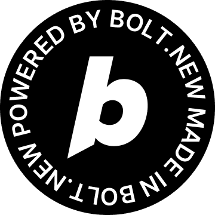

# Game Vibe Engine

[](https://bolt.new/)

**Revolutionizing game development through conversational AI - Built for the World's Largest Hackathon 2025**

Game Vibe Engine is the world's first AI-native game development IDE that transforms game creation through natural language conversations. Built as a VS Code extension, it bridges the gap between game ideas and playable experiences by enabling developers to create games through conversation while providing professional visual tools for precision work.

## 🎮 What Makes It Special

- **Conversational Game Development**: Describe games in plain English and watch them compile into working code
- **Custom Game Description Language (GDL)**: AI-optimized syntax that reduces token usage by 80%
- **Professional Visual Editors**: Sprite editor, level designer, and audio studio built into VS Code
- **Real-Time Hot-Reload**: Instant compilation with game state preservation
- **Entity-Component-System Architecture**: Professional game engine foundation
- **AI-Powered Audio**: ElevenLabs integration for voice synthesis and sound generation

## 🚀 Quick Start

### Prerequisites

- **Node.js** (v16 or higher)
- **VS Code** (latest version)
- **Git** for version control

### Installation & Setup

1. **Clone the repository**
   ```bash
   git clone https://github.com/yourusername/game-vibe-engine.git
   cd game-vibe-engine
   ```

2. **Install dependencies**
   ```bash
   npm install
   ```

3. **Compile the extension**
   ```bash
   npm run compile
   ```

4. **Open in VS Code**
   ```bash
   code .
   ```

5. **Run the extension**
   - Press `F5` to open a new VS Code window with the extension loaded
   - Or use `Ctrl+Shift+P` and run "Game Vibe Engine: Open"

### Development Commands

```bash
# Start development with automatic compilation
npm run dev

# Build for production
npm run build

# Run tests
npm run test

# Run linting
npm run lint

# Clean build artifacts
npm run clean
```

## 🎯 How to Use

### 1. Create Your First Game

Open the Game Vibe Engine panel and start a conversation:

```
"Create a platformer with a jumping player, moving enemies, and collectible coins"
```

The AI will generate GDL code like this:

```gdl
game PlatformerDemo {
    physics: { gravity: [0, 800] }
}

entity Player {
    physics: platformer
    behaviors: [Moveable, Jumpable]
    sprite: "player.png"
}

entity Enemy {
    behaviors: [Patrol, KillOnTouch]
    sprite: "enemy.png"
}

scene Level1 {
    spawn Player at [100, 400] as player
    spawn Enemy at [300, 400] as enemy
    
    when player touches enemy: {
        player.takeDamage(1)
        if player.health <= 0:
            scene.restart()
    }
}
```

### 2. Use Visual Editors

- **Sprite Editor**: Create pixel art with advanced panning tools and animation support
- **Level Designer**: Build levels with drag-and-drop entities and real-time preview
- **Audio Studio**: Generate voice and sound effects using ElevenLabs AI

### 3. Iterate and Polish

- Make changes through conversation or visual tools
- Watch games update instantly with hot-reload
- Export and share your creations

## 📁 Project Structure

```
game-vibe-engine/
├── src/
│   ├── ai/                  # AI processing layer
│   │   ├── IntentRecognizer.ts
│   │   ├── CommandGenerator.ts
│   │   └── ContextManager.ts
│   ├── gdl/                 # GDL compiler pipeline
│   │   ├── Lexer.ts
│   │   ├── Parser.ts
│   │   ├── SemanticAnalyzer.ts
│   │   └── CodeGenerator.ts
│   ├── core/                # Game engine core
│   │   ├── EntityManager.ts
│   │   ├── ComponentManager.ts
│   │   └── SystemManager.ts
│   ├── systems/             # Game systems
│   │   ├── PhysicsSystem.ts
│   │   ├── RenderingSystem.ts
│   │   └── InputSystem.ts
│   ├── servers/             # Visual editor servers
│   │   ├── EnhancedSpriteEditorServer.ts
│   │   ├── EnhancedLevelDesignerServer.ts
│   │   └── EnhancedMusicEditorServer.ts
│   ├── components/          # React UI components
│   └── export/              # Export functionality
├── assets/                  # Game assets and examples
├── contest_docs/            # Contest documentation
├── out/                     # Compiled extension
├── package.json
└── tsconfig.json
```

## 🎪 Demo Games

The repository includes several demo games showcasing different capabilities:

- **Platformer Demo**: Physics-based jumping and enemy interactions
- **Puzzle Game**: Logic-based tile matching mechanics  
- **RPG Demo**: Character dialogue and inventory systems
- **Educational Games**: Math and science learning experiences

Run any demo by opening its `.gdl` file and clicking "Compile & Run".

## 🛠️ Architecture Overview

Game Vibe Engine uses a three-layer architecture:

1. **Natural Language Interface**: AI-powered intent recognition and command generation
2. **GDL Compiler**: Custom language compilation pipeline (Lexer → Parser → Semantic Analysis → Code Generation)
3. **Game Engine Runtime**: Entity-Component-System architecture with Phaser.js rendering

### Key Technologies

- **Frontend**: TypeScript + React for VS Code extension UI
- **Game Engine**: Custom ECS architecture built on Phaser.js
- **Compiler**: Hand-written lexer/parser for GDL with AST generation
- **AI Integration**: Pattern-based intent recognition with context management
- **Audio**: ElevenLabs API integration for voice synthesis
- **Visual Editors**: Canvas-based sprite editor and level designer

## 🎓 For Educators

Game Vibe Engine transforms computer science education by making game development accessible:

- **Immediate Results**: Students create games in minutes, not weeks
- **Visual Learning**: Understand programming through interactive examples
- **Cross-Curricular**: Create educational games for any subject
- **Inclusive**: Supports different learning styles and technical backgrounds

See `/contest_docs/about_the_project.md` for detailed educational applications.

## 🤝 Contributing

We welcome contributions! Here's how to get started:

1. **Fork the repository**
2. **Create a feature branch**: `git checkout -b feature/amazing-feature`
3. **Make your changes** and test thoroughly
4. **Run linting**: `npm run lint`
5. **Commit your changes**: `git commit -m 'Add amazing feature'`
6. **Push to the branch**: `git push origin feature/amazing-feature`
7. **Open a Pull Request**

### Development Setup

1. Install all dependencies: `npm install`
2. Start the compiler in watch mode: `npm run compile:watch`
3. Open VS Code and press `F5` to launch the extension host
4. Make changes and reload the extension host to test

## 📄 License

This project is licensed under the MIT License - see the [LICENSE](LICENSE) file for details.

## 🏆 Contest Information

**Built for the World's Largest Hackathon 2025**

Game Vibe Engine was created specifically for this hackathon to demonstrate the power of AI-native development tools. It represents a new paradigm where complex creative domains become accessible through conversational AI.

**Key Contest Themes Addressed:**
- **AI-Powered Development**: Conversational game creation with intelligent code generation
- **Beginner-Friendly**: No prior game development experience required
- **Open Source Innovation**: Professional tools built for the community
- **Educational Impact**: Transforming how programming and game design are taught

## 🎯 Roadmap

### Current Status (v0.1.0)
- ✅ Basic GDL compiler with entity-component system
- ✅ Conversational AI interface with intent recognition
- ✅ Professional sprite editor with panning tools
- ✅ Multi-layer level designer
- ✅ ElevenLabs audio integration
- ✅ Real-time hot-reload compilation

### Near-term Goals (v0.2.0)
- 🔄 Enhanced GDL syntax with more game mechanics
- 🔄 Advanced visual effects and particle systems
- 🔄 Expanded audio processing capabilities
- 🔄 Performance optimization for larger games
- 🔄 Community sharing and collaboration features

### Long-term Vision (v1.0.0)
- 🎯 Multi-platform export (web, desktop, mobile)
- 🎯 Advanced AI features and design suggestions
- 🎯 Educational curriculum integration
- 🎯 Plugin architecture for community extensions
- 🎯 Cloud platform for hosting and sharing games

## 📞 Support & Community

- **Issues**: Report bugs and request features on [GitHub Issues](https://github.com/yourusername/game-vibe-engine/issues)
- **Discussions**: Join conversations in [GitHub Discussions](https://github.com/yourusername/game-vibe-engine/discussions)
- **Documentation**: Comprehensive guides in `/contest_docs/`
- **Examples**: Demo games and tutorials in `/assets/`

## 🎪 Built with Bolt.new

This project showcases the power of [Bolt.new](https://bolt.new/) for rapid prototyping and AI-assisted development. The initial architecture, GDL compiler, and core features were rapidly prototyped using Bolt.new's conversational development capabilities, then enhanced and professionalized using Claude Code.

**Bolt.new Impact:**
- **Rapid Prototyping**: Core concept to working prototype in days
- **AI-Native Design**: Language and architecture optimized for AI conversation
- **Iterative Development**: Continuous refinement through AI collaboration
- **Professional Enhancement**: Seamless transition to advanced development tools

---

**Game Vibe Engine - Where Conversation Meets Creation**

*Transform your game ideas into playable experiences through the power of AI-assisted development. The future of game development starts with a conversation.*